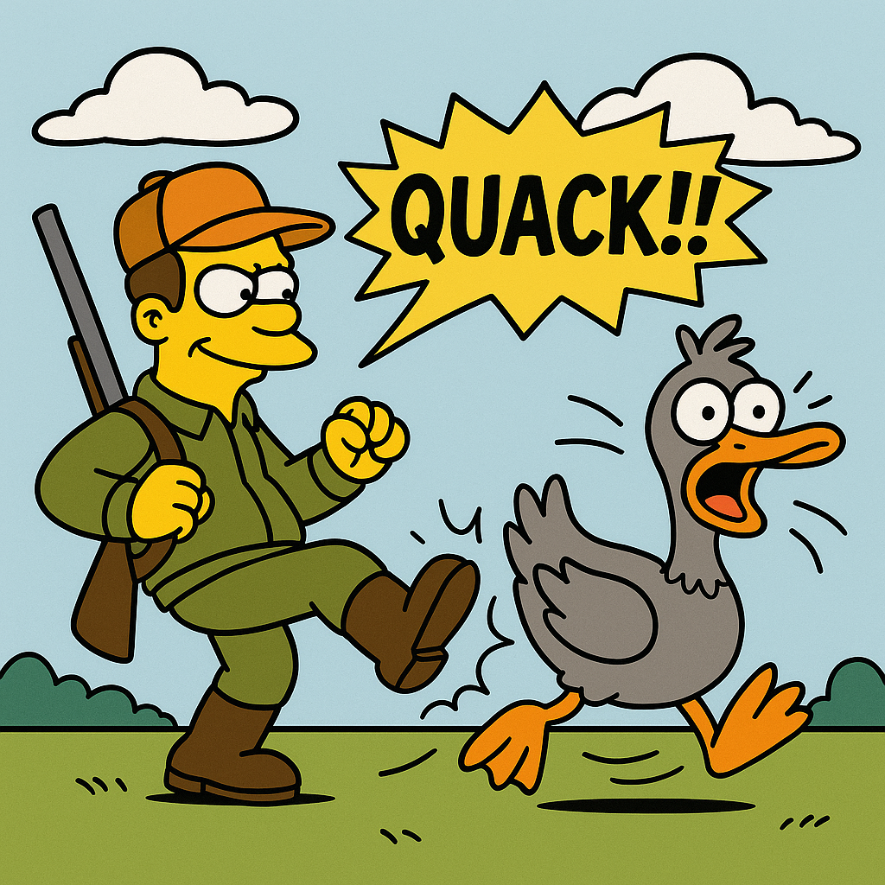

---

## ❌ Not That Duck (Seriously)

You might have seen another package called [`duck`](https://www.npmjs.com/package/duck).  
It’s great — but **completely different** from what we’re doing here.

Here's a quick comparison:

| Feature         | [`duck`](https://www.npmjs.com/package/duck) | `quackquack` (`@on-the-ground/quack`)            |
| --------------- | -------------------------------------------- | ------------------------------------------------ |
| 📦 Purpose      | Assertion matcher for tests                  | Runtime signature validator                      |
| 🧠 Focus        | _Structural_ object matching                 | _Behavioral_ contract matching                   |
| 🔍 Scope        | Deep introspection of object contents        | Zero introspection – ignores internals           |
| 🧪 Typical Use  | `duck.assertThat(obj, matcher)`              | `expectQuack('(string, number) => boolean')(fn)` |
| ⚠️ Fails If     | Object is missing properties                 | Function signature doesn’t match                 |
| 📘 Mental Model | “Does this object look like this?”           | “Can this function play the Role I expect?”      |

---

## 🎯 Philosophy: Only the Role Matters

`quackquack` doesn’t care how your function is implemented.  
We don’t parse the body.  
We don’t read its variables.  
We don’t care if it mutates state, opens a socket, or whispers to ducks.

We **only** care about one thing:

> **Does it look like it can play the Role?**  
> _(As defined by its signature.)_

That’s it.

You can define Roles declaratively using our DSL:

```ts
const duckFn = expectQuack("(string, number?) => boolean")(fn);
```

Or check full objects at once:

```ts
const duckObj = expectDuck({
  add: "(number, number) => number",
  log: "(string) => void",
})(obj);
```

Under the hood, this creates a **runtime contract** —  
a guarantee that your function (or object) **quacks like the Role it's meant to play**.

---

## ✨ Why Use `quackquack`?

- ✅ Works at **runtime** — no TypeScript required
- ✅ Zero dependence on internal object structure
- ✅ Perfect for **plugin systems**, **dynamic registries**, **adapter validation**
- ✅ Supports `strict` mode: fail if shape doesn't match exactly
- ✅ Bridges the gap between _duck typing_ and _role declaration_

---

## 🧬 Minimalism By Design

> “We’re not here to judge how you built it —  
> we just want to know if it can do the job.”

That’s the `quackquack` way.

No reflection. No object traversal.  
Just plain, declarative, behavioral contracts.

---

## 🚀 Quick Start

This library helps you **declare Roles** via a lightweight DSL, and **enforce them** at runtime or with decorators.

### ✅ 1. Mark a function as quackable

```ts
const greet = quackable("(name: string) => void")((name) => {
  console.log(`Hello, ${name}`);
});
```

---

### ✅ 2. Mark a method with the same decorator

```ts
class Greeter {
  @quackable("(name: string) => void")
  greet(name: string) {
    console.log(`Hi, ${name}`);
  }
}
```

---

### ✅ 3. Enforce quack match with expectQuack

```ts
const greet = expectQuack("(name: string) => void")(greetFromArgs);
```

> If the function wasn't decorated, it'll be wrapped with validation.  
> If already decorated but mismatched, it throws.

---

### ✅ 4. Enforce a whole object with expectDuck

```ts
const role = expectDuck({
  greet: "(name: string) => void",
  add: "(x: number, y: number) => number",
})(obj);
```

> Each method will be verified to match the expected Role signature.

---

## ✍️ Quack DSL: Writing Quack Signatures

The Quack DSL supports two styles for writing function signatures:

```ts
(name: string, age?: number) => void  // JavaScript-style
(string, number?) => void             // Simplified
```

Both are valid and compiled to the same internal representation.

Note: The DSL is inspired by JavaScript, but it doesn't aim to replicate JS syntax exactly.
Its purpose is to express roles, not real function declarations.

---

## 🪶 Ultra-Light: No Overhead, No Interference

Once a function or method is `quackable` (i.e., decorated with `@quackable`),  
`quackquack` will **not wrap, proxy, or alter** it in any way.

When you `expectQuack` a `quackable` function,

It simply compares two **precompiled QuackAsts**:

- ✅ The **expected** signature string
- ✅ The **given** function’s signature

That’s it.  
No call-time parsing. No reflection.  
**Zero overhead. Near-instant validation.**

This makes it ideal for:

- Performance-sensitive plugin systems
- Dynamically loaded modules
- High-frequency contract checks

---

## ☁️ And Yes, We Can Expect Non-Quackables Too

Not every function needs to be `quackable`.  
You can still use `expectQuack` or `expectDuck`  
on plain JavaScript functions or objects.

In that case, `quackquack` will fall back to **runtime introspection**,  
using tools like [`zod`](https://github.com/colinhacks/zod)  
to validate the shape of parameters, arity, and behavior.

So even if you forgot (or chose not) to decorate it —  
you’re still covered.

✅ **Decorated?** Instant match by signature → Zero overhead  
✅ **Undecorated?** Smart fallback with runtime validation  
✅ **You?** Worry-free API contract checking 🫶

---

## 🎭 Role-First Object Orientation

This project is named after Alan Kay — not because it’s directly affiliated with him, but because we deeply respect his philosophy of **message passing between objects**.
Our intention is to carry that spirit forward.

Ironically, however, to truly honor that spirit, we believe we must **break free from the habit of treating everything as an object**.

Objects only gain real value when they **aren’t created arbitrarily**.
An object deserves to exist only when it can **justify its presence** —
specifically, when it can **fulfill a Role**.

In this regard, we depart from Alan Kay's assertion that “everything is an object.”
We say instead: **“Everything begins with a Role.”**
A Role arises first, born from a concrete need.
Then, and only then, does an object emerge — as a **candidate** that may fulfill that Role.

**Messages are not sent to objects, but to Roles.**
An object is simply a responder — an implementer of the behavior required by the Role.

---

## 🧱 Classes Do Not Represent Roles

We often treat classes as mere “bundles of data and methods.”
But starting with data and then slapping on some methods quickly leads to
**unprincipled, trash-bin objects**.

Objects are meant to represent **high cohesion**.
But what defines “right” cohesion has always been ambiguous.
Now, we propose a clear answer: **the right cohesion comes from the right Role**.

A Role is essentially **a collection of related functions**.
For example, the role of a `Transaction` might include `play` and `rollback`.
These functions are grouped not because they share data,
but because they **share responsibility for the same behavior**.

In this light, cohesion should be driven not by data,
but by **behavior and responsibility**.

---

## ⏳ Avoid Bring-Up First Design

If you design objects before you clearly understand the roles they need to fulfill,
you fall into the trap of **Bring-Up First Design** —
an accidental architecture shaped by momentum rather than intention.

The most valuable objects and roles
only become clear **when you wait for genuine needs to emerge**.
The longer you delay their introduction,
the sharper and more robust they become.

---

## 🔍 Class vs Role

| Concept      | Role                                 | Class                                 |
| ------------ | ------------------------------------ | ------------------------------------- |
| Declared by  | The side that **needs** the behavior | The side that **produces** the object |
| Purpose      | Specify **behavioral expectations**  | Describe **internal structure**       |
| Focus        | “Can you handle this message?”       | “What are you made of?”               |
| Prerequisite | Must satisfy external demand         | Reflects internal design              |

While classes describe objects from the inside out,
**Roles describe them from the outside in** — from the perspective of **what the world needs**.

---

## 🧠 Real OOP Is About Behavior, Not Reflection

Real object-oriented programming doesn't ask:

> “What are you made of?”

That's reflection — and it has no place in message-driven design.

Instead, real OOP asks:

> “I need someone who can play this role. Can you handle it?”

Everything should be designed around **behavior and responsibility**,
not around static structure.

```

```
